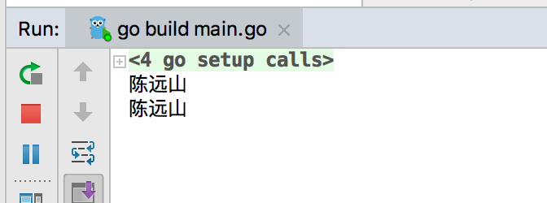

# 9.1作业
## 作业题目

### 1. 尽可能多的写出整个课程，我们学习并掌握到的知识点
	1. 区块的数据结构。每个区块包括的元素
	2. 区块链的结构。一个区块衔接一个区块，可以追溯到创世区块
	3. 工作量证明。通过调整nonce值，计算一个小于设定值的hash，完成工作量证明
	4. 序列化。将区块序列号为一个[]byte方便进行传输和存储
	5. 使用数据库持久化。使用kv数据库，对保存区块序列化后的数据
	6. 使用命令操作区块链的创世区块创建、创建新钱包、打印区块信息等等的功能
	7. 区块交易的数据结构。TxIn、TxOut。TxIn对应着本次交易使用到的币的上一笔交易输出。TxOut记录本次交易的交易金额已经接受方的公钥hash
	8. 挖矿奖励。矿工成功挖出一个符合要求的区块，系统自动给与这个矿工一个奖励（特殊的交易，没有对应的TxIn）。
	9. UTXO。未花费交易输出。通过记录区块中的UTXO，方便查询每次交易所需要引用的TxOut已经某个地址所拥有的币数量。
	10. Merkle树。对区块打包的交易，通过一系列的hash操作，最后生成一个hash，可以通过验证某一个交易到最终hash那条路径是否正确，来判断那个交易是否包含在这个区块里面或者是是否被人修改过
	11. 节点之间通信，主节点、挖矿节点、普通节点各种节点需要负责的功能
	12. p2p协议。
	13. 一致性协议。
	14. 虚拟机。otto和EVM
	15. 智能合约。智能合约的编写、部署、以及使用api调用智能合约

### 2. 描述本次课程中POW代码实现逻辑
通过修改区块的nonce值，计算nonce值修改后区块的序列化的hash，如果hash的值小于设定的值（通过target设定生成的值前面需要多少位的0），则本次成功。如果不小于，则nonce值加1，重复上面步骤，知道符合要求位置

### 3. 本次课程中数据库如何实现增删改查，以及操作原理。
	
打开数据库。`db, err := bolt.Open(DBName, 0600, nil)`
查看使用View、更新使用Update、删除使用Delete
例如：要修改数据库

```
err = db.Update(func(tx *bolt.Tx) error {
		
		b := tx.Bucket([]byte(UTXOSetBucketName))
		...
	})
```
tx.Bucket 为要取得要具体操作的表

原理：
存储：将要存储到数据库的对象序列化后，存储到数据库里面
提取：通过查找对应的key，获取之前存储在数据库的序列化，反序列化后得到某个对象，再对对象进行操作。


### 4.图⽂并茂完整的描述，本次课程中钱包地址⽣生成过程

1. 根据椭圆曲线算法，产生随机私钥
2. 通过私钥获得公钥（通过椭圆曲线乘法可以从私钥计算得到公钥）
3. 将公钥sha256、ripemd160 获得公钥hash
4. 公钥经过2次sha256获得一个hash值，取这个hash值的前4个字节为校验位
5. 在公钥hash前拼接0x00版本号，后面拼接校验位。再进行base58编码获得钱包地址
	


### 5.图⽂并茂完整的描述，根据两个实例描述本次课程UTXO模型的巧妙设计

因为课程的区块链中，对应账户并不会存储自己的余额，而是要靠计算所有的交易里面的TxIn和TxOut中未使用的部分，作为自己的余额。

1. 在转账交易中，一方要转账给另外一方，需要通通过先查看自己有哪些TxOut是自己可以使用的，再从这些Txout中随机选出满足本次交易金额的那些Txout，生成本地交易的TxInt。每个交易的TxInt都会指向对应的交易的TxOut，这样，每个人能使用的钱都是能一直追溯到源头的。这样可以验证每个交易TxIn是不是合法的，安全性也得到提高
2. 节点会通过计算钱包对应哪些交易是未花费的，并存储UTXOset，这样在交易时，就不需要通过重新遍历整个区块链来找出可以花费的部分，提高了交易的效率。每次生成新的区块后，更新UTXOset，方便下一次的使用。 用户在查询自己的余额的时候，也可以更方便的查取，不用遍历整个区块。只要跟踪本地钱包节点的UTXO就可以完成一般的交易的，而不用再本地存储整个区块，大大的减轻了钱包的存储空间。
	

### 6.本次课程中，私钥如何签名，公钥是如何验证签名的

签名：

1. 将交易的TxIn中的TxId、签名、公钥置空，TxOut复制 生成一个新的交易副本
2. 将副本的TxIn中公钥设置成对应的TxOut的公钥hash
3. 序列号交易副本
4. hash序列化的交易数据，将结果设置成副本TxIn的TxId
5. 通过算法，使用上面的TxId以及私钥生成签名

验证签名：

1. 重复上面的1至4步，获取TxId
2. 通过交易的Input的公钥、私钥以及上面生成的数据，计算签名是否正确

### 7.简述Merkle树的生成过程
	1.将本区块要打包的所有交易看作是merkle树的子叶节点、如果数量为单数则复制最后一个交易到交易数组里面。
	2.将每个交易数据hash
	3.将相邻的两两hash拼接后进行hash，成为下一层的子节点hash
	重复上面3的步骤，直到最后生成一个最终的hash值

### 8.完整的描述节点区块同步的逻辑和过程(如有必要，附上核心代码)
	1. 所有节点都会监听自己被指定的端口
	2. 如果当前节点非主节点，需要向主节点发送version消息
	3. 当节点收到version消息，判断当前节点区块高度是否大于对方节点：大于则向对方发送version消息。小于或等于，向对方发送getBlocks消息
	4. 节点收到getBlocks消息后，向对方发送inv消息，消息内容包括当前节点的区块的hash的集合
	5. 收到inv消息后，判断当前节点是否已经包含里面的block，向对面请求getdata消息获取当前节点没有的block
	6. 收到getdata消息后，向对面发送对应的block的序列化数据sendBlock消息
	7. 收到sendBlock消息后，反序列化block数据，保存到本地区块链上。重复知道本地同步完所有对方的区块信息

### 9.运⾏Otto，编写⼀一个简单的合约，将合约提交到虚拟机进⾏行行编译运⾏行行，附 属上相关截图

```
function Homework(){
    this.printSomething = function() {
      return "陈远山";
    }
}
var object = new Homework();
```




### 10.图文并茂描述，本次课程中，solidity编写智能合约，实现发布代币的过程，并模拟账户地址之间转账交易。

发币的智能合约实现ERC20相关接口

```
contract EIP20{
    function totalSupply() view returns (uint256 totalSupply);
    function balanceOf(address _owner) view returns (uint256 balance);
    function transfer(address _to, uint256 _value) returns (bool success);
    function approve(address _spender, uint256 _value) returns (bool success);
    function transferFrom(address _from, address _to, uint256 _value) returns (bool success);
    function allowance(address _owner, address _spender) view returns (uint256 remaining);
    event Transfer(address indexed _from, address indexed _to, uint256 _value);
    event Approval(address indexed _owner, address indexed _spender, uint256 _value);
}

```

进行部署


部署成功后查看发币地址的代币数量


转账 向第二个地址转账10代币


查看结果


